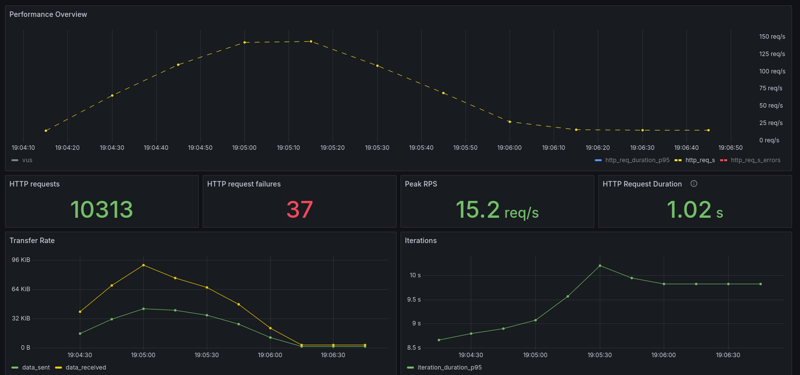
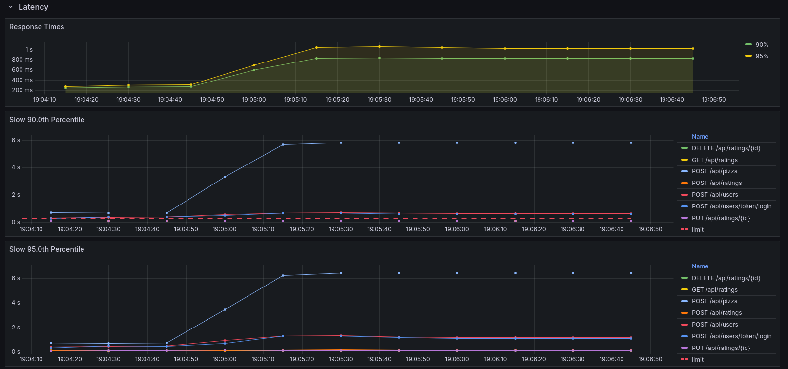
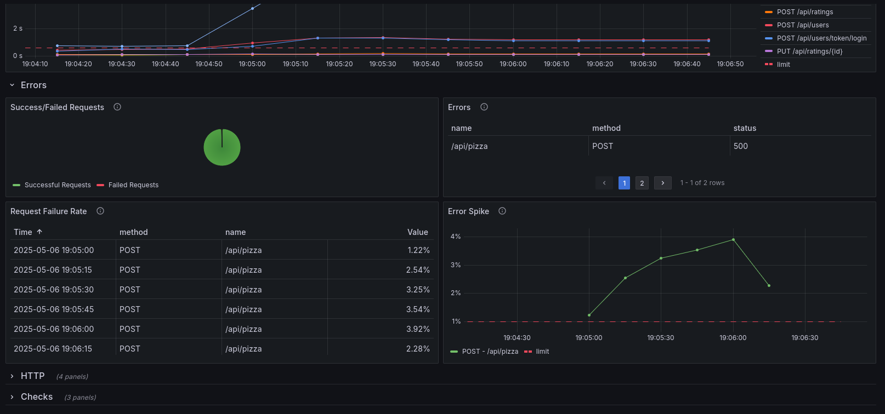

# k6 Quickpizza Non-Functional tesing POC

This is a POC of performance/non-functional testing a backend API using Grafana k6.

Since [test-api.k6.io](https://test-api.k6.io) is now deprecated and redirects to the [Quickpizza API](https://github.com/grafana/quickpizza), I've used that for this project. Quickpizza has an [openapi.yaml](https://github.com/grafana/quickpizza/blob/main/quickpizza-openapi.yaml) file that can be loaded into [Swagger editor](https://editor.swagger.io/) to get a view of how it works and even test it directly from swagger, making it easy to write test scripts for it's endpoints.

This POC project is built using plain javascript, npm and node and uses eslint for linting, prettier for code formatting and lint-staged to run these on pre-commit, ensuring no unchecked code gets merged. It also reuses code from the [k6-oss-workshop](https://github.com/grafana/k6-oss-workshop) project to run Grafana and Prometheus for Observability.

## Covered endponts

```{.bash }
POST /api/users             # Register a new user
POST /api/users/token/login # User login

POST /api/pizza             # Get a pizza recommendation

POST /api/ratings           # Create a new rating
GET /api/ratings            # Get all ratings by user
PUT /api/ratings/{id}       # Update a rating
DELETE /api/ratings/{id}    # Delete a rating
```

## Structure

```
k6-quickpizza-nft-poc/
├─ api/           # Models the quickpizza API endpoint using reusable k6 functions
├─ config/        # Contains k6 workload and threshold config files as well as prometheus and grafana config files
├─ data_creation/ # Contains the data creation scripts and their output files
├─ libs/          # Contains the custom k6 library that can write to filesystem
├─ load_tests/    # Contains the k6 load test scripts
├─ reports/       # Report files
├─ utils/         # Utility functions for the load test scripts
```

## Load tests

There are three files found in the [load_tests](https://github.com/cosmaprc/k6-quickpizza-nft-poc/tree/main/load_tests) direcotry, all using the same shared and reusable /api and /config functions:

- [single-spike-scenario.js](https://github.com/cosmaprc/k6-quickpizza-nft-poc/blob/main/load_tests/single-spike-scenario.js) - Single scenario workload with sequential journey calls and no setup phase
- [multiple-spike-scenarios.js](https://github.com/cosmaprc/k6-quickpizza-nft-poc/blob/main/load_tests/multiple-spike-scenarios.js) - Multiple individual scenarios run together. Contains a setup phase as well for shared user authentication.
- [multiple-spike-scenarios-with-data-creation.js](https://github.com/cosmaprc/k6-quickpizza-nft-poc/blob/main/load_tests/multiple-spike-scenarios-with-data-creation.js) - Same as the above but instead of a shared user authentication setup phase, it uses a CSV file created with a separate [data-creation.js](https://github.com/cosmaprc/k6-quickpizza-nft-poc/blob/main/data_creation/data-creation.js) script to load pre-created authentication tokens used in journeys that require the user to be authenticated.

## Test environments

- `test` - Runs a local single run functional smoke test to verify all journeys are working
- `dev` - Runs a Spike test on a local deployment of the Quickpizza API found at [localhost:3333](http://localhost:3333)
- `prod` - Runs a Spike test against the live API at [quickpizza.grafana.com](https://quickpizza.grafana.com/)

## Start/Stop Prometheus and grafana

Courtesy of Grafana [k6-oss-workshop](https://github.com/grafana/k6-oss-workshop)

- [localhost:3000/dashboards](http://localhost:3000/dashboards)
- [localhost:9090/query](http://localhost:9090/query)

```bash
# Start docker, grafana and a local quickpizza app
docker compose up -d

# Stop
docker compose down
```

## Run the main load test script

Main test scripts are [multiple-spike-scenarios.js](https://github.com/cosmaprc/k6-quickpizza-nft-poc/blob/main/load_tests/multiple-spike-scenarios.js) for test and dev and [single-spike-scenario.js](https://github.com/cosmaprc/k6-quickpizza-nft-poc/blob/main/load_tests/single-spike-scenario.js) for prod env due to an issue with the multiple spike scenario script that seems to get worse when hitting the live API as opposed to the local one. The run will generate an html-report.html and a result.html file, besides the text summary as well as send metrics to Prometheus/Grafana.

***Note, to run npm commands you will need to install node and npm which you can do with the node version manager [nvm](https://github.com/nvm-sh/nvm) , alternatively, the scripts can be run directly using the k6 command which will also need to be installed.***

```bash
npm test # points to the local API so you have to have started that one first
npm run dev # also points to the local API
npm run prod # points to the live API
```

## Or run without npm, using k6 directly

```bash
K6_WEB_DASHBOARD=true K6_WEB_DASHBOARD_EXPORT=html-report.html K6_PROMETHEUS_RW_TREND_STATS=p\(90\),p\(95\),min,max k6 run --out=experimental-prometheus-rw --summary-trend-stats min,avg,med,max,p\(90\),p\(95\) ./load_tests/multiple-spike-scenarios.js -e ENVIRONMENT=prod # test/dev/prod
```
```bash
K6_WEB_DASHBOARD=true K6_WEB_DASHBOARD_EXPORT=html-report.html K6_PROMETHEUS_RW_TREND_STATS=p\(90\),p\(95\),min,max k6 run --out=experimental-prometheus-rw --summary-trend-stats min,avg,med,max,p\(90\),p\(95\) ./load_tests/single-spike-scenario.js -e ENVIRONMENT=prod # test/dev/prod
```

## Run data creation to create the data.csv file with a valid token and run the load test

```bash
cd ./data_creation
../libs/k6 run ./data-creation.js -e ENVIRONMENT=dev
cd ../
K6_WEB_DASHBOARD=true K6_WEB_DASHBOARD_EXPORT=html-report.html K6_PROMETHEUS_RW_TREND_STATS=p\(90\),p\(95\),min,max k6 run --out=experimental-prometheus-rw --summary-trend-stats min,avg,med,max,p\(90\),p\(95\) ./load_tests/multiple-spike-scenarios-with-data-creation.js -e ENVIRONMENT=dev # test/dev
```

## (Optional) Building a k6 version that can write to the filesystem for data creation

***This is optional and only if you want to run the [multiple-spike-scenarios-with-data-creation.js](https://github.com/cosmaprc/k6-quickpizza-nft-poc/blob/main/load_tests/multiple-spike-scenarios-with-data-creation.js) script which needs the [data-creation.js](https://github.com/cosmaprc/k6-quickpizza-nft-poc/blob/main/data_creation/data-creation.js) script to be run first, which in turn needs a k6 version that can write to the filesystem***

### Install golang and set up the PATH so it can run xk6

- [go-installation.html](https://developer.fedoraproject.org/tech/languages/go/go-installation.html)
- [unable-to-locate-xk6-after-installing-it](https://community.grafana.com/t/unable-to-locate-xk6-after-installing-it/99016)

### Install xk6

- [build-k6-binary-using-go](https://grafana.com/docs/k6/latest/extensions/build-k6-binary-using-go/)

```bash
go install go.k6.io/xk6/cmd/xk6@latest
```

### Build a k6 version that has the xk6-filewriter go module to write to file

- [xk6-filewriter](https://github.com/Dataport/xk6-filewriter)

```bash
xk6 build --with github.com/Dataport/xk6-filewriter
```

### Run data creation to create the data.csv file with a valid token

```bash
cd ./data_creation
../libs/k6 run ./data-creation.js -e ENVIRONMENT=dev
```

## Quickpizza performance analysis

First the purpose of a spike test: "A spike test verifies whether the system survives and performs under sudden and massive rushes of utilization."

### Test setup

There are 7 calls, depending on the script run, they are all in the same scenario or in multiple. Each call has a sleep(1) at the end for more predictible RPS.

Spike test shape:

```
  executor: "ramping-vus",
  startVUs: 0,
  stages: [
    { duration: "1m", target: TARGET_RPS_OR_VUS * NUMBER_OF_CALLS_PER_SCENARIO_ITERATION },
    { duration: "1m", target: 0 },
  ],
  gracefulRampDown: "0s",
```

Set some potentially sensible default limits(Let's assume these are our SLOs):

```
90% - 300ms
95% - 600ms
```

Add some extra graphs to the k6 Prometheus dashboard:

- Latency:
  - Reponse times per percentile we monitor
  - Response times per percentile and per endpoint url we test
- Errors
  - Success/Failed Requests - Request distribution by success and failure
  - Errors - Errors seen, grouped by url, method and status code
  - Request Failure Rate - Rate of failed requests by url and method
  - Error Spike - Request error spikes by url and method

Fresh start the local quickpizza setup using docker compose up/down before each test run to avoid issues.

### Test runs

***Note, report files for these runs, inlcuding prod can be found in [reports](https://github.com/cosmaprc/k6-quickpizza-nft-poc/tree/main/reports)***

Let's use the local quickpizza deployment firs, instead of the live/prod api so we have more control and use it as a baseline for comparison.

```bash
# Start docker, grafana and a local quickpizza app
docker compose up -d
```

```bash
# Run the test
npm run dev
```

1 - Take a baseline spike scenario

```
scenarios: (100.00%) 2 scenarios, 7 max VUs, 2m0s max duration (incl. graceful stop):
        * createAndLoginUserScenario: Up to 2 looping VUs for 2m0s over 2 stages (gracefulRampDown: 0s, exec: createAndLoginUserScenario, gracefulStop: 30s)
        * crudPizzaRatingScenario: Up to 5 looping VUs for 2m0s over 2 stages (gracefulRampDown: 0s, exec: crudPizzaRatingScenario, gracefulStop: 30s)
```

From the start we can see that the test has failed because the POST /api/pizza is unacceptably slow even at this low RPS:

```
✓ http_req_duration..............................: min=593.74µs avg=48.02ms  med=1.27ms   max=638.47ms p(90)=60.29ms  p(95)=387.12ms
    { expected_response:true }...................: min=593.74µs avg=48.02ms  med=1.27ms   max=638.47ms p(90)=60.29ms  p(95)=387.12ms
  ✗ { url:/api/pizza,method:POST }...............: min=9.61ms   avg=233.28ms med=105.02ms max=638.47ms p(90)=544.56ms p(95)=552.68ms
  ✓ { url:/api/ratings,method:POST }.............: min=803.76µs avg=1.2ms    med=1.24ms   max=1.6ms    p(90)=1.39ms   p(95)=1.46ms
  ✓ { url:/api/ratings/{id} ,method:DELETE }.....: min=693.03µs avg=1.01ms   med=1ms      max=1.37ms   p(90)=1.17ms   p(95)=1.23ms
  ✓ { url:/api/ratings/{id},method:PUT }.........: min=593.74µs avg=1.09ms   med=1.08ms   max=1.9ms    p(90)=1.26ms   p(95)=1.29ms
  ✓ { url:/api/users/token/login,method:POST }...: min=45.1ms   avg=46.94ms  med=46.44ms  max=53.19ms  p(90)=49.47ms  p(95)=49.8ms
✓ http_req_failed................................: 0.00%   ✓ 0        ✗ 406
```

Since latency fails the test from the start, let's continue running spike test in a binary search style until we find a peak spike TPS where we have an acceptable error count.

2 - 70 max VUs targeting 70 RPS

```
✓ http_req_duration..............................: min=573.75µs avg=44.23ms  med=1.12ms   max=732.42ms p(90)=57.01ms p(95)=204.31ms
    { expected_response:true }...................: min=573.75µs avg=44.23ms  med=1.12ms   max=732.42ms p(90)=57.01ms p(95)=204.31ms
  ✗ { url:/api/pizza,method:POST }...............: min=4.08ms   avg=204.64ms med=90.73ms  max=732.42ms p(90)=548.6ms p(95)=598.28ms
  ✓ { url:/api/ratings,method:POST }.............: min=658.41µs avg=1ms      med=948.96µs max=3.56ms   p(90)=1.22ms  p(95)=1.38ms
  ✓ { url:/api/ratings/{id} ,method:DELETE }.....: min=573.75µs avg=823.47µs med=765.2µs  max=2.19ms   p(90)=1.01ms  p(95)=1.18ms
  ✓ { url:/api/ratings/{id},method:PUT }.........: min=579.95µs avg=874.34µs med=812.46µs max=2.67ms   p(90)=1.11ms  p(95)=1.28ms
  ✓ { url:/api/users/token/login,method:POST }...: min=44.02ms  avg=47.01ms  med=46.68ms  max=55.31ms  p(90)=49.52ms p(95)=50.34ms
✓ http_req_failed................................: 0.00%   ✓ 0         ✗ 4050
```

3 - 700 max VUs targeting 700 RPS

More than 10% of requests failed, 10 times past the threshold, let's reduce RPS

```
✗ http_req_duration..............................: min=279.37µs avg=389.66ms med=85.89ms  max=9.96s    p(90)=1.21s    p(95)=1.7s
    { expected_response:true }...................: min=473.74µs avg=385.53ms med=92.66ms  max=9.96s    p(90)=1.09s    p(95)=1.65s
  ✗ { url:/api/pizza,method:POST }...............: min=3.83ms   avg=705.18ms med=573.06ms max=2.95s    p(90)=1.54s    p(95)=1.75s
  ✗ { url:/api/ratings,method:POST }.............: min=442.65µs avg=361.56ms med=49.83ms  max=9.33s    p(90)=1.11s    p(95)=1.89s
  ✗ { url:/api/ratings/{id} ,method:DELETE }.....: min=297.96µs avg=412.86ms med=10.7ms   max=9.61s    p(90)=1.32s    p(95)=2s
  ✗ { url:/api/ratings/{id},method:PUT }.........: min=279.37µs avg=390.99ms med=8.68ms   max=9.2s     p(90)=1.25s    p(95)=1.99s
  ✓ { url:/api/users/token/login,method:POST }...: min=44.65ms  avg=99.46ms  med=69.28ms  max=631.66ms p(90)=188.21ms p(95)=248.85ms
✗ http_req_failed................................: 10.10% ✓ 3061       ✗ 27218
```

4 - 350 max VUs so targeting 350 max RPS

```
scenarios: (100.00%) 2 scenarios, 350 max VUs, 2m0s max duration (incl. graceful stop):
        * createAndLoginUserScenario: Up to 100 looping VUs for 2m0s over 2 stages (gracefulRampDown: 0s, exec: createAndLoginUserScenario, gracefulStop: 30s)
        * crudPizzaRatingScenario: Up to 250 looping VUs for 2m0s over 2 stages (gracefulRampDown: 0s, exec: crudPizzaRatingScenario, gracefulStop: 30s)
```

Better, though latency is still an issue. Let's increase it again.

```
✓ http_req_duration..............................: min=495.79µs avg=52.88ms med=12.64ms  max=804.97ms p(90)=90.24ms  p(95)=226.08ms
    { expected_response:true }...................: min=495.79µs avg=52.88ms med=12.64ms  max=804.97ms p(90)=90.24ms  p(95)=226.08ms
  ✗ { url:/api/pizza,method:POST }...............: min=3.56ms   avg=226.5ms med=112.58ms max=804.97ms p(90)=562.01ms p(95)=616.44ms
  ✓ { url:/api/ratings,method:POST }.............: min=684.87µs avg=5.58ms  med=1.21ms   max=140.42ms p(90)=14.04ms  p(95)=26.02ms
  ✓ { url:/api/ratings/{id} ,method:DELETE }.....: min=495.79µs avg=5.88ms  med=1.18ms   max=160.77ms p(90)=15.95ms  p(95)=27.02ms
  ✓ { url:/api/ratings/{id},method:PUT }.........: min=524.33µs avg=5.48ms  med=1.17ms   max=133.93ms p(90)=15.28ms  p(95)=23.08ms
  ✓ { url:/api/users/token/login,method:POST }...: min=44.27ms  avg=54.44ms med=52.57ms  max=133.29ms p(90)=63.02ms  p(95)=68.67ms
✓ http_req_failed................................: 0.00%   ✓ 0          ✗ 20087
```

5 - 441 max VUs targeting 441 RPS

```
scenarios: (100.00%) 2 scenarios, 441 max VUs, 2m0s max duration (incl. graceful stop):
        * createAndLoginUserScenario: Up to 126 looping VUs for 2m0s over 2 stages (gracefulRampDown: 0s, exec: createAndLoginUserScenario, gracefulStop: 30s)
        * crudPizzaRatingScenario: Up to 315 looping VUs for 2m0s over 2 stages (gracefulRampDown: 0s, exec: crudPizzaRatingScenario, gracefulStop: 30s)
```

441 max virtual users or RPS seems to be within our 1% error threshold so barring the attrocious latency, we might say we've found the limit at which the system is still usable in a sudden spike scenario.

```
✗ http_req_duration..............................: min=362.34µs avg=105.13ms med=51.02ms max=2.12s    p(90)=303.95ms p(95)=513.53ms
    { expected_response:true }...................: min=467.07µs avg=105.02ms med=51.02ms max=2.12s    p(90)=303.88ms p(95)=513.03ms
  ✗ { url:/api/pizza,method:POST }...............: min=3.82ms   avg=323.03ms med=251ms   max=1.62s    p(90)=672.63ms p(95)=795.89ms
  ✓ { url:/api/ratings,method:POST }.............: min=607.81µs avg=53.09ms  med=4.96ms  max=1.51s    p(90)=162.11ms p(95)=250.49ms
  ✓ { url:/api/ratings/{id} ,method:DELETE }.....: min=410.41µs avg=70.48ms  med=7.38ms  max=1.42s    p(90)=219.68ms p(95)=381.18ms
  ✓ { url:/api/ratings/{id},method:PUT }.........: min=362.34µs avg=65.92ms  med=5.8ms   max=1.72s    p(90)=209.76ms p(95)=343.67ms
  ✓ { url:/api/users/token/login,method:POST }...: min=44.54ms  avg=68.02ms  med=57.17ms max=245.44ms p(90)=102.94ms p(95)=127.97ms
✓ http_req_failed................................: 0.04%  ✓ 12         ✗ 24088
```

Now let's compare this with a live prod run, but note that there likely is an issue with the code in the multiple-spike-scenarios.js script as it fails certain `api/ratings/{id}` calls with Bad Request(`400 Bad Request {"error":"operation not permitted for default user"}`) and authentication issues even at low RPS, likely due to cookies being needed in the live prod env compared to the local testing env, so for testing prod, the default script is [single-spike-scenario.js](https://github.com/cosmaprc/k6-quickpizza-nft-poc/blob/main/load_tests/single-spike-scenario.js)

```bash
npm run prod
```

After several tests following a similar binary search approach as with the local API, the following seems to be the highest peak RPS run that does not breach the errors threhold, while the latency is horrendous anyway so ignoring it for now:

```
scenarios: (100.00%) 1 scenario, 210 max VUs, 2m0s max duration (incl. graceful stop):
        * my_scenario: Up to 210 looping VUs for 2m0s over 2 stages (gracefulRampDown: 0s, gracefulStop: 30s)
```

```
█ Pizza operations

  ✗ Got pizza
  ↳  97% — ✓ 1479 / ✗ 37

✗ http_req_duration..............................: min=92.68ms avg=228.78ms med=103.7ms  max=4.89s    p(90)=419.35ms p(95)=677.43ms
    { expected_response:true }...................: min=92.68ms avg=220.66ms med=103.44ms max=3.9s     p(90)=409.16ms p(95)=661.19ms
  ✗ { url:/api/pizza,method:POST }...............: min=98.42ms avg=404.3ms  med=208.82ms max=4.89s    p(90)=736.11ms p(95)=899.33ms
  ✓ { url:/api/ratings,method:POST }.............: min=93.03ms avg=108.01ms med=96.04ms  max=998.89ms p(90)=110.76ms p(95)=169.95ms
  ✓ { url:/api/ratings/{id} ,method:DELETE }.....: min=92.68ms avg=102.58ms med=94.98ms  max=1.09s    p(90)=100.27ms p(95)=109.33ms
  ✓ { url:/api/ratings/{id},method:PUT }.........: min=93.08ms avg=103.28ms med=95.4ms   max=1.4s     p(90)=100.39ms p(95)=123.09ms
  ✗ { url:/api/users/token/login,method:POST }...: min=158.8ms avg=367.77ms med=217.47ms max=3.9s     p(90)=590.3ms  p(95)=1.1s    
✓ http_req_failed................................: 0.35%  ✓ 37        ✗ 10276
```

Reports for this prod run can be found at [result-30vus.html](./reports/prod/result-30vus.html) and [html-report-30vus.html](./reports/prod/html-report-30vus.html) and for grafana, you can find screenshots below:





## TODOS

- Secrets like the user password used to authenticate with the API can be saved using gitcrypt locally or in a k8s environment as secret files mounted in the test pods or even pulled from Vault.
- The scenarios all run either a local smoke test in the test env or a simplistic spike test that does not control the rate of requests per second sent to the api very well. An improvement would be to use another scenario type like the constant or ramping arrival rate ones to better control RPS per endpoint under test. Also having a stress test coupled with a longer soak test would likely be the way to go.
- The default quickpizza grafana dashboard does not show the per endpoint/transaction RPS rates in percentiles over time, so we could improve on this to get a better view of how the RPS changes per endpoint during the test run.
- The data creation example uses CSV files but we could switch to JSON based files using [msgpack](https://msgpack.org/index.html) for "efficient binary serialization"
